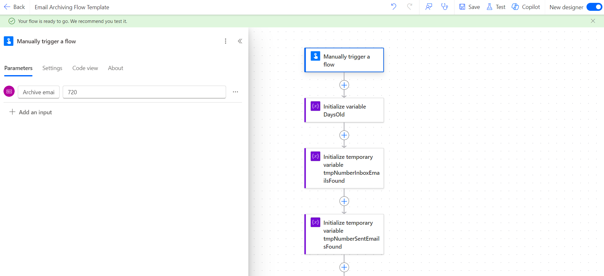
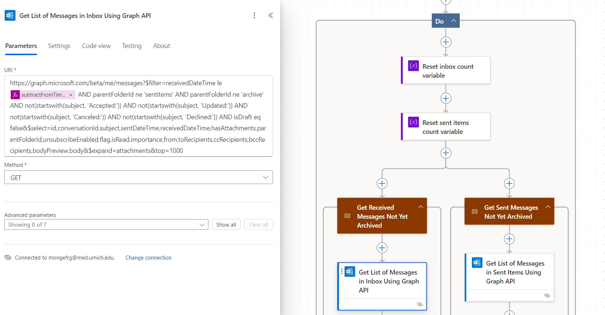
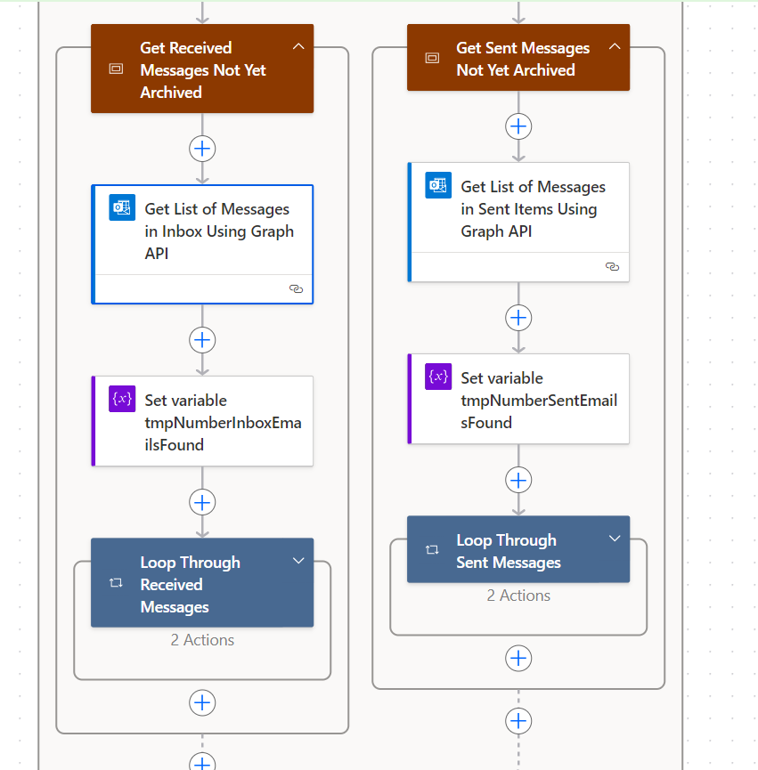
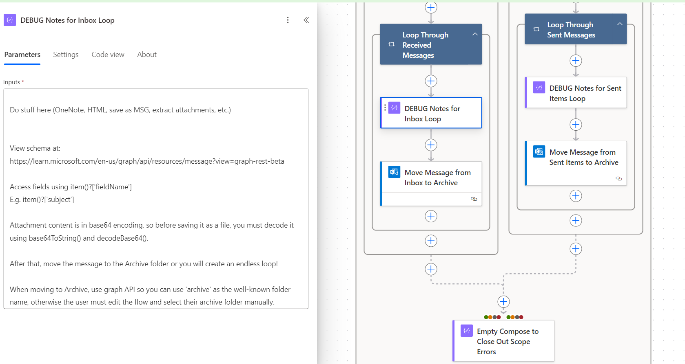
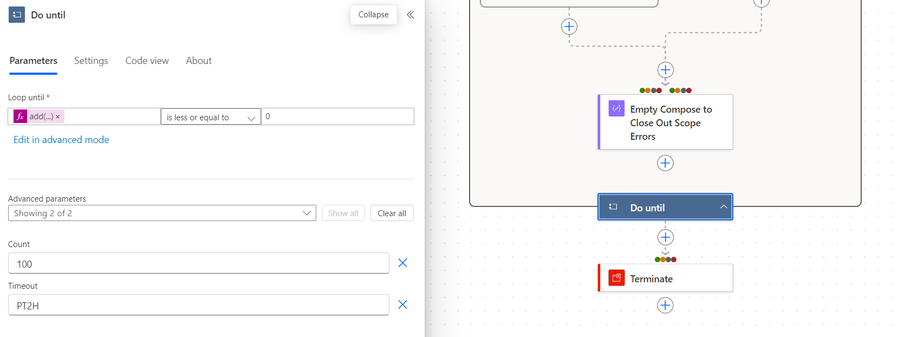

# Email Archiving Flow Template

## Summary
This PowerAutomate flow template shows how to get up to 1,000 emails at a time from Outlook, including attachments. It uses HTTP calls to allow for greater flexibility.

### Contributors:
+ Gabriel Mongefranco [(@gabrielmongefranco)](https://github.com/gabrielmongefranco)

## Details
+ Manually trigger a flow: this flow can be started manually. The only input is the how old an email must be to get archived, in days. If needed, change this to another trigger type, such as running on a schedule.
+ Initialize variable DaysOld: defaults to the input from the manual trigger. If you change the trigger to something else, like a schedule, you must set the value of this variable. Default is 720.
+ Do loop: Retrieve up to 1,000 messages at a time from inbox and sent items, excluding meeting accepted/cancelled/rejected notifications, and move them to the archive folder. The loop runs until no more messages are found, or when the timeout is reached (2 hours).
  + This is divided into two parallel branches, one for inbox and one for sent items, to allow greater flexibility for flows that need to put them in separate folders.
  + See the "DEBUG" step for notes and ideas of what you can do inside this loop. For example, you can export emails to EML and save to OneDrive, or you can send them to OneNote and only send attachments to OneDrive.
+ Terminate step: this used for gracefully exiting the flow. If you use a different type of trigger, you can change this step, just be sure to configure Run After properties to execute your step after success, failure and timeout of the Do loop.

## Download
[EmailArchivingFlowTemplate.zip](EmailArchivingFlowTemplate.zip)
